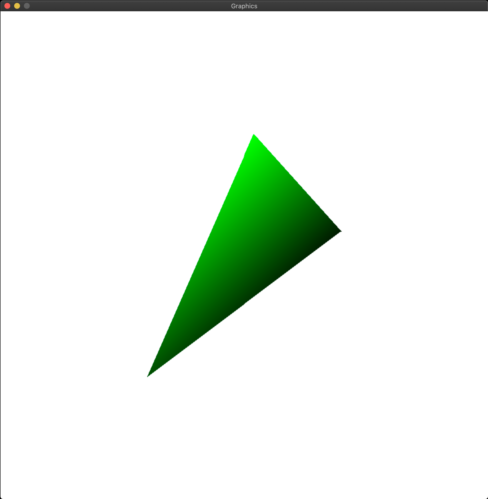

# SDL3DGraphicsEngine

Attempting to build a library to render basic 3d graphics from (almost) scratch using  
only a "draw pixel" and a window borrowed from a library, which in this case is SDL2.  

Currently we are cheating a bit by using SDL_RenderClear() to fill the screen, I will  
probably fix this eventually but it's a low priority. 

So far I've been following along sort of closely to Gabriel Gambetta's [book](https://gabrielgambetta.com/computer-graphics-from-scratch)  
on creating computer graphics from scratch.

For now though we only have triangles :)

I will update this image to demonstrate new progress as it comes.

## Goal

My goal is to render the [Utah Teapot](https://en.wikipedia.org/wiki/Utah_teapot)
Not sure if or when I will get there, have not been working on this project too often. 

# TODO
- [x] Rasterization
- [x] Project, Transform and Translate
- [ ] Clipping
- [ ] Only Render visible surfaces
- [ ] Shading
- [ ] Load Blender Files
- [ ] Better SDL abstraction (so we can swap it out for another libary and not have to pass around SDL_Renderer as much, preferably not at all)
- [ ] Implement Proper Matrix multiplication library
