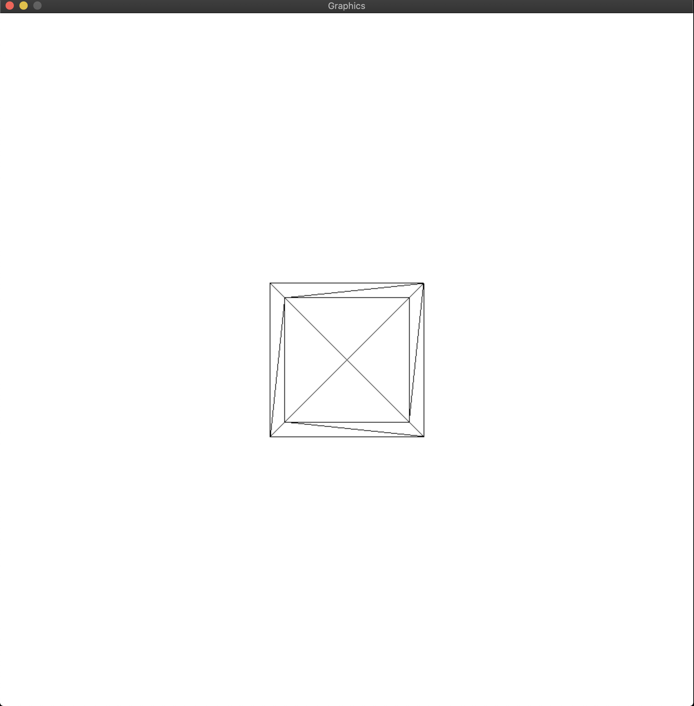

# SDL3DGraphicsEngine

Attempting to build a library to render basic 3d graphics from (almost) scratch using  
only a "draw pixel" and a window borrowed from a library, which in this case is SDL2.  

Currently we are cheating a bit by using SDL_RenderClear() to fill the screen, I will  
probably fix this eventually but it's a low priority. 

So far I've been following along sort of closely to Gabriel Gambetta's [book](https://gabrielgambetta.com/computer-graphics-from-scratch)  
on creating computer graphics from scratch.

Currently we can render a wireframe of 3d objects:

The next step is Depth Buffering so we can render a filled in cube (with flat colored surfaces)

I will update this image to demonstrate new progress as it comes.

## Goal

My goal is to render the [Utah Teapot](https://en.wikipedia.org/wiki/Utah_teapot)
Not sure if or when I will get there, have not been working on this project too often. 

# TODO
- [x] Rasterization
- [x] Project, Transform and Translate
- [x] Depth Buffering
- [ ] Shading
- [ ] Load Blender Files
- [ ] Refactor out any library specific stuff from the core logic (SDL)

# Maybe
- [ ] Clipping
- [ ] Back face culling
